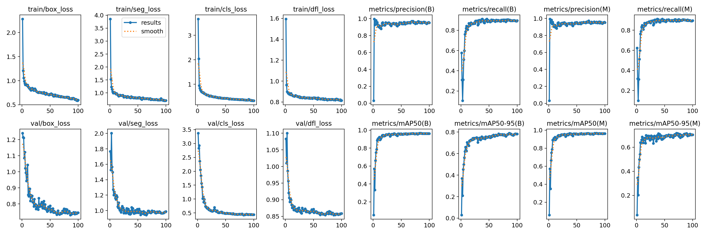

<details>
  <summary>Table of Contents</summary>
  <ol>
    <li>
      <a href="#introduction">Introduction</a>
    </li>
    <li><a href="#technical-tools">Technical Tools</a></li>
    <li><a href="#data-source">Data source</a></li>
    <li><a href="#data-processing">Data processing</a></li>
    <li><a href="#the-design">The design</a></li>
    <li><a href="#results">Results</a></li>
    <li><a href="#how-to-use-the-source-code">How to use the source code</a></li>
    <li><a href="#reference">Reference</a></li>
  </ol>
</details>

### Introduction

<ul style="padding-left: 20px; list-style-type: circle;">
        <li>The project includes 5 repositories:
            <ul>
                <li>
                <a href="https://github.com/LeoUtas/Mitochondria_segmentation_research_detectron2.git" style="text-decoration: none; color: #3498db;">Mitochondria instance segmentation research using Detectron2</a>
                </li>
                <li>
                <a href="https://github.com/LeoUtas/Mitochondria_segmentation_research_YOLOv8.git" style="text-decoration: none; color: #3498db;">Mitochondria instance segmentation research using YOLOv8</a>
                </li>                
                <li>
               <a href="https://github.com/LeoUtas/Mitochondria_segmentation_flask_detectron2.git" style="text-decoration: none; color: #3498db;">Mitochondria instance segmentation web application using Detectron2</a>
                </li>
                <li>
                <a href="https://github.com/LeoUtas/Mitochondria_segmentation_flask_YOLOv8.git" style="text-decoration: none; color: #3498db;">Mitochondria instance segmentation web application using YOLOv8</a>
                </li>
                <li>
                <a href="https://github.com/LeoUtas/Mitochondria_segmentation_flask_2models.git">Mitochondria instance segmentation web application using Detectron2 and YOLOv8 for better comparison</a>
                </li>
            </ul>
        </li>
        <br>
        <li>
            I attempted to solve the mitochondria instance segmentation using 2 different tools (i.e., <a href="https://github.com/facebookresearch/detectron2/blob/main/README.md">Detectron</a> and <a href="https://github.com/ultralytics/ultralytics"> YOLOv8 </a>). The results indicated that, for this particular task, Detectron2 demonstrated superior performance over YOLOv8. However, in some cases, YOLOv8 performed better on the task of object detection.
            Detectron2 was chosen to deploy on a web application for this instance segmentation tasks <a href="https://mito-app-651cbfda9bde.herokuapp.com/">(visit the live demo)</a>.
        </li>        
    </ul>

This repository hosts the source code for mitochondria instance segmentation research using YOLOv8.

### Technical tools

The orginal paper of You Only Look Once YOLO architecture <a href="https://arxiv.org/pdf/1506.02640.pdf">(Redmon, J. et al., 2016)</a>.

The application documentation of <a href="https://docs.ultralytics.com/"> YOLOv8 </a> by Ultralytics.

-   Pytorch
-   YOLOv8
-   Opencv
-   numpy
-   pandas
-   scikit-image
-   leafmap
-   matplotlib
-   seaborn
-   Docker

### Data source

This project utilizes an electron microscopy image dataset from the CA1 area of the hippocampus, annotated for mitochondria by highly trained researchers. For more information and access to the dataset, visit the <a href="https://www.epfl.ch/labs/cvlab/data/data-em/"> Electron Microscopy Dataset</a>.

### Data processing

This project makes use of a dataset that includes PNG images along with their corresponding COCOJSON annotations. For the purpose of transforming these COCOJSON annotations into the TXT format, as required by YOLO, I utilized and refined some code originally introduced by <a href="https://www.youtube.com/watch?v=NYeJvxe5nYw"> Bhattiprolu, S., 2023</a>.

The usage of DataHandler and AnnotationHandler

```python
# Make image data
convert_to_yolo_data(path_to_input_images, path_to_input_JSON, path_to_output_images, path_to_output_labels)

# Make the YAML configuration file
make_yaml(path_to_input_JSON, path_to_output_yaml, path_to_train, path_to_test, path_to_val)
```

### The design


The above diagram illustrates the fundamental architecture of this project. Below, you will find an example outline detailing the code setups necessary for experimenting with various configurations of YOLOv8 for this specific task.

Model configuration for experiment was done in the file YOLO8_0.py with the outline of code structure as follows:

```python
# ________________ MAKE MODEL CONFIGURATION ________________ #
# ****** --------- ****** #
test_name = "test2"
note = ""
# ****** --------- ****** #
model_yaml = "yolov8x-seg.yaml"
model_pt = "yolov8x-seg.pt"

# ________________ MAKE TRAIN DATA READY FOR TRAINING ________________ #
...

# custom configuration
...

model = YOLOSegmentation(
    ...
)

# _ TRAIN _ #
model.train()

```

Ultralytics provides a comprehensive model evaluation for each time of model training. In this project, I simply arranged for the model results to be stored in a specifically named folder, corresponding to the name of the test, within the models directory.

### Results

This project involved numerous experiments, but only the most significant results are highlighted here.

<br>

<h6 align="center">
Model performance metrics
</h6>

<p align="center">
    
</p>

<br>

<h6 align="center">
Visualization of prediction on an unseen image (name: test_001.png)
</h6>

<p align="center">
    
</p>

<br>

<h6 align="center">
Visualization of the ground truth for the predicted image (name: test_001.png)
</h6>

<p align="center">
    
</p>

<br>

In a comparative experiment with this dataset, I evaluated both Detectron2 and YOLOv8. The results indicated that, for this particular task, Detectron2 demonstrated superior performance over YOLOv8 (see <a href="https://mito-app-651cbfda9bde.herokuapp.com/"> comparison images)</a>. However, in some cases, YOLOv8 performed better on the task of object detection.

<br>

### How to use the source code

##### Using the source code

-   Fork/clone this repository (https://github.com/LeoUtas/Mitochondria_segmentation_research_YOLOv8.git).
-   First thing first, before proceeding, ensure that you are in the root directory of the project.
-   Make a virtual environment (the following guide is for Windows users, you might need to adapt it to your OS, if needed)

```cmd
python -m venv venv
```

-   Activate the venv using Powershell

```cmd
.\venv\Scripts\Activate.ps1
```

-   Install required dependencies

```cmd
pip install -r requirements.txt
```

-   It might take a while for completing the installation. Once, the installation is done, you're good to go for exploring the code functionalities.

I'm excited to share this repository! Please feel free to explore its functionalities. Thank you for this far. Have a wonderful day ahead!

Best,
Hoang Ng

### Reference

Bhattiprolu, S. (2023, Sep 20). 332 - All about image annotations​ [Video]. YouTube. https://www.youtube.com/watch?v=NYeJvxe5nYw

Redmon, J. et al., 2016. You Only Look Once: Unified, Real-Time Object Detection. In 2016 IEEE Conference on Computer Vision and Pattern Recognition (CVPR). pp. 779–788.
